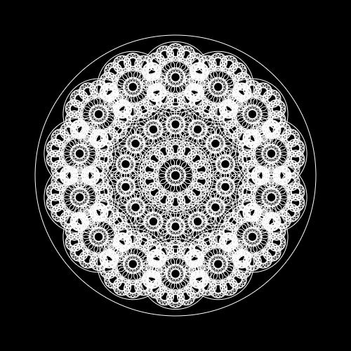

# multiverse

A little sketch in Processing 3 that draws a "multiverse" with recursion.

Example output:

## How to use the code in this repository:

### The quick and dirty way:

Just copy-paste the code out of the [multiverse.pde](multiverse/multiverse.pde) sketch or download the entire repo as a .zip file and access the code that way.

### The Git way:

1. Fork this repository.
2. Clone your fork to your computer.
3. Create your own branch.
4. Make some changes, and commit them to your branch.
5. Push those changes to your remote repository on GitHub.
6. If you want, make a pull request on GitHub to offer to add your code to this original repository.
